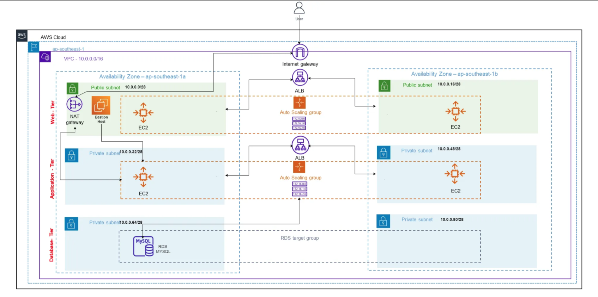
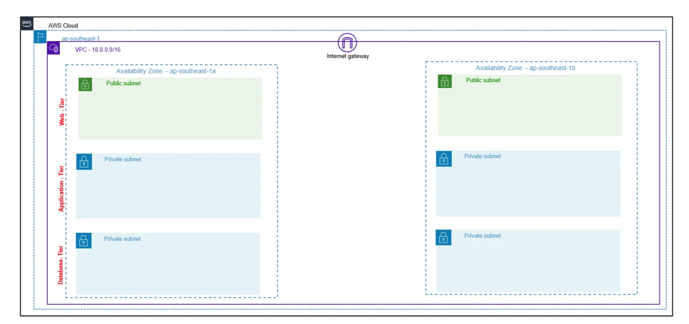

# Simplified Guide to Deploying a Three-Tier Architecture on AWS Using Terraform

When creating a cloud-based application, the right architecture is key to ensuring scalability, availability, and security. Infrastructure-as-Code (IaC) tools like Terraform are now widely used to automate the setup and management of cloud resources.

This guide will walk you through deploying a highly available three-tier architecture in AWS using Terraform. The setup includes:

- **Web and App Tier**: EC2 Auto Scaling Groups
- **Data Tier**: RDS MySQL database
- **Secure Access**: Bastion Host

By leveraging Terraform, you can efficiently manage and scale your resources while ensuring high availability and security. Let’s dive in!

## What Is Three-Tier Architecture and Why Use It?

Three-Tier Architecture is a well-known pattern for cloud applications. It enhances scalability, availability, and security by breaking an application into three distinct layers, each performing a specific role. These layers are distributed across multiple Availability Zones (AZs) for maximum resilience.

### Benefits of Three-Tier Architecture:
- **High Availability**: If one AZ goes down, the system scales resources to another AZ without disruption.
- **Improved Security**: Each layer has its own security group, limiting traffic to only what’s necessary.
- **Scalability**: Each layer operates independently, making it easier to scale as demand grows.

## Understanding the Three Layers

### Web/Presentation Layer (Front End):
- Handles user interaction through web servers or interfaces.
- Hosts the visual part of the application.

### Application Layer (Back End):
- Processes data and executes the application’s core functions.
- Contains the logic or backend code.

### Data Layer:
- Manages and stores data in a database, like RDS MySQL.
- Ensures reliable and secure data storage.

## Why Start With Three-Tier?

This structure not only separates responsibilities for better efficiency but also makes it easier to secure and manage the application. Multiple AZs ensure high availability, while the independent security groups keep communication between layers tight and controlled.

By using Terraform, deploying a three-tier architecture becomes straightforward and efficient. Ready to take the next step? Let’s build a scalable and secure application!

# The Scenario

You’ve been tasked with designing and building the architecture for a new web application. The objective is to plan and implement a robust environment to host the application.

## Prerequisites

### 1. AWS Account
- Ensure you have an AWS account with IAM user access configured.

### 2. Code Editor
- Use a code editor like **VS Code** for managing your Terraform files and configurations.

### 3. Linux Command Knowledge
- Basic understanding of Linux commands, scripting, and SSH is necessary for setting up and managing the deployment.

### 4. Terraform Documentation Reference
- Use the [Terraform Registry](https://registry.terraform.io/) for module examples and configuration guides.

## Architecture Diagram:

# Three-Tier Architecture Components

Here’s a breakdown of the components for the three-tier architecture we’ll deploy:

## VPC Configuration
- **Create a VPC** with CIDR `10.0.0.0/16` to house all resources.

## Public Subnets
- **2 public subnets** with CIDR blocks:
  - `10.0.0.0/28`
  - `10.0.0.16/28`
- Each subnet will be in a different **Availability Zone** to ensure high availability.

## Private Subnets
- **4 private subnets**:
  - `10.0.0.32/28` and `10.0.0.48/28` for the application tier.
  - `10.0.0.64/28` and `10.0.0.80/28` for the database tier.
- Place each private subnet in a **separate Availability Zone** for redundancy.

## Database Tier
- Deploy an **RDS MySQL** instance for secure data storage.

## Load Balancers
- Use an **Application Load Balancer (ALB)** to direct traffic:
  - From users to the **web tier** (public subnets).
  - From the **web tier** to the **application tier** (private subnets).

## EC2 Auto Scaling Groups
- Deploy one **EC2 Auto Scaling Group** in each:
  - Public subnet for the **web tier**.
  - Private subnet for the **application tier**.
- This ensures **high availability** across both tiers.

## Networking
- Set up an **Internet Gateway**, **NAT Gateway**, and **Elastic IPs** for external and internal communication.

## Bastion Host
- Deploy a **bastion host** in the public subnet for secure **SSH access** to servers in the private subnets.

# Creating a `provider.tf` File

The `provider.tf` file specifies the cloud provider and initializes its configuration for Terraform to interact with. see code in terraform directory. 

# Network Architecture Components

The network architecture for this setup will include the following AWS services:

## VPC
- Create a VPC with a CIDR block of `10.0.0.0/16`.

## Public Subnets (Web Tier)
- Two public subnets with CIDR blocks:
  - `10.0.0.0/28`
  - `10.0.0.16/28`
- Each subnet will be placed in a different **Availability Zone** to ensure high availability.

## Private Subnets (Application Tier)
- Two private subnets with CIDR blocks:
  - `10.0.0.32/28`
  - `10.0.0.48/28`
- Both subnets will be distributed across two **Availability Zones**.

## Private Subnets (Database Tier)
- Two additional private subnets with CIDR blocks:
  - `10.0.0.64/28`
  - `10.0.0.80/28`
- Like the application subnets, these will also be placed in separate **Availability Zones**.

## Public Route Table
- A public route table will be created to connect the **public subnets** to an **Internet Gateway**.

## Private Route Table
- A private route table will be set up to connect the **application tier private subnets** to a **NAT Gateway** for internet access.

This structure ensures a **scalable** and **highly available** network for the application.

# Create a `network.tf` File
this code will create VPC, Public Subnets, Internet Gateway, and Private Subnets

# Creating Route Tables

To facilitate communication between the web tier and the application tier, we’ll define two route tables:

## Public Route Table
- **Use case**: Designated for the **web tier** and linked to the **public subnets** hosting the load balancer.
- **Function**: Ensures that web servers can route traffic externally and to the **application tier**.

## Private Route Table
- **Use case**: Assigned to the **application tier** and associated with **private subnets** hosting the application servers.
- **Function**: Allows app servers to securely communicate with the **web tier** and access the internet via the **NAT gateway**.

By associating these route tables with their respective subnets, traffic is directed only to the intended destinations. The web servers and application servers utilize these route tables to securely and efficiently communicate with each other as needed.

# Creating a NAT Gateway

A **NAT Gateway** enables instances in private subnets to connect to external resources outside the VPC, such as the internet, for tasks like applying patches or updating packages.

For **high availability**, the recommended practice is to deploy two NAT gateways—one in each public subnet across different **Availability Zones**. However, in this setup, we will deploy just **one** NAT gateway for simplicity.

# Tier 1: Web Tier (Frontend)

The **Web Tier**, also referred to as the **Presentation Tier**, is where users interact with the application. For this setup, we’ll deploy web servers to host the frontend of our application, ensuring scalability and high availability.

---

## Web Tier Components

**Launch Template**  
- Defines the specifications for EC2 instances, including the instance type, AMI, and security group.

**Auto Scaling Group (ASG)**  
- Dynamically provisions EC2 instances based on demand.  
- Spreads instances across multiple Availability Zones in **public subnets** to ensure high availability.

**Application Load Balancer (ALB)**  
- Distributes incoming traffic evenly across EC2 instances.  
- Monitors instance health to direct traffic only to available servers.

**Security Group**  
- Manages inbound and outbound traffic for the web servers.  
- Allows only necessary ports and sources to reduce security risks.

---

## High Availability and Traffic Distribution

**Dynamic Scaling**  
- The ASG ensures the application can handle traffic fluctuations by automatically scaling the number of EC2 instances up or down based on demand.

**Traffic Distribution**  
- The ALB ensures even traffic distribution across the web servers, improving performance and reliability.  
- It also checks the health of instances and routes traffic only to healthy ones.

**Security**  
- A security group will restrict access to the web servers, limiting it to only necessary sources and ports.  
- This enhances the security posture of the tier.

---

### a) Create EC2 Auto Scaling Group and Launch Template

To achieve high availability and prevent single points of failure, we’ll configure the following:

**Launch Template**  
- Defines the EC2 instance configuration, including:
  - **Instance Type**: Determines the performance characteristics (e.g., `t2.micro`).  
  - **AMI**: Specifies the operating system and pre-configured software.  
  - **Security Group**: Controls network access to the EC2 instances.

**Auto Scaling Group**  
- Dynamically launches and terminates EC2 instances based on demand.  
- Distributes instances across multiple Availability Zones within the **public subnets**.

This setup ensures the frontend is **highly available**, **scalable**, and **secure**, ready to handle varying traffic loads efficiently.
